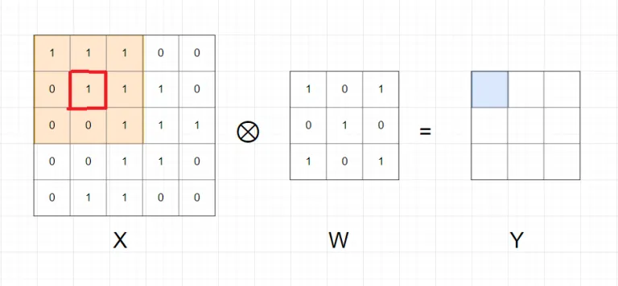
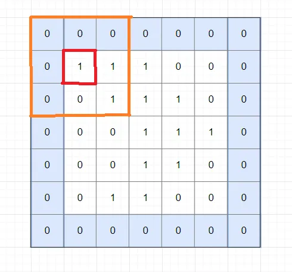
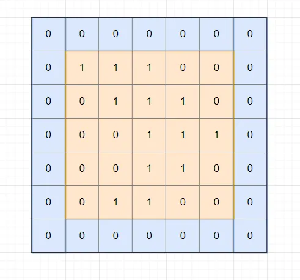
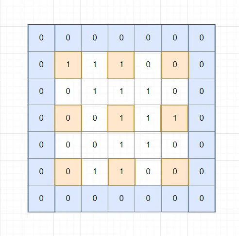
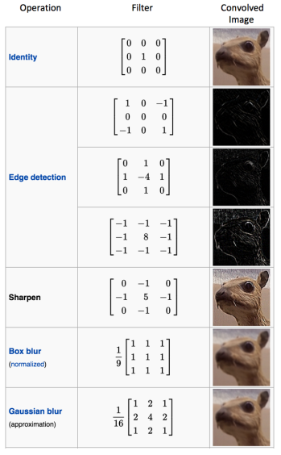
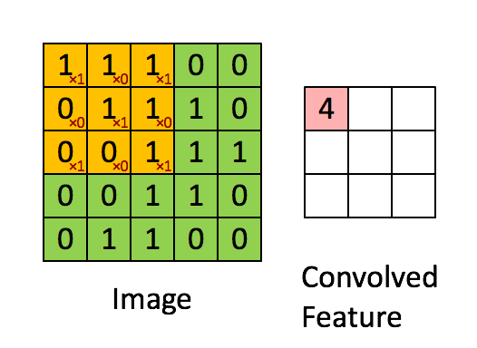
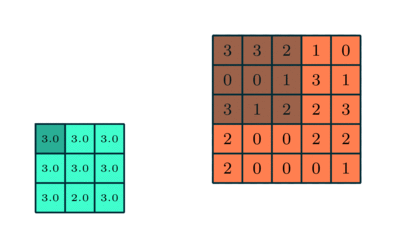
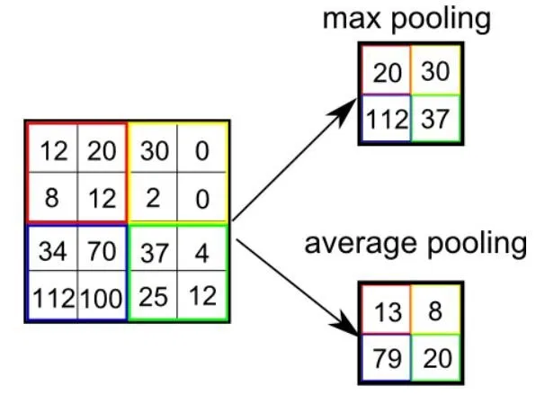
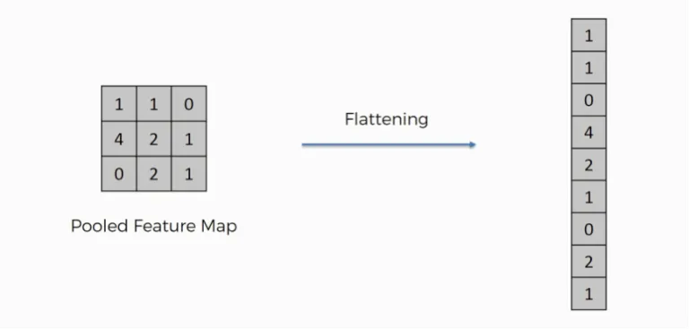

# Lý thuyết
## 1. Phép tính Convolution
### 1.1 Convolution
Để cho dễ hình dung mình sẽ lấy ví dụ trên ảnh xám, tức là ảnh được biểu diễn dưới dạng ma trận A kích thước $m*n$.

Ta định nghĩa **kernel** là một ma trận vuông kích thước $k*k$ với k lẻ, kí hiệu là W.

### 1.2 Padding
Mỗi lần thực hiện phép tính convolution xong thì kích thước ma trận Y đều nhỏ hơn X. Nếu ta muốn ma trận Y thu được có kích thước bằng ma trận X thì ta sẽ thêm các giá trị 0 ở viền ngoài ma trận X.

 
 
 Phép tính này gọi là convolution với padding=1. Padding = k nghĩa là thêm k vector 0 vào mỗi phía của ma trận.
 
### 1.3 Strides
 Ta thực hiện tuần tự các phần tử trong ma trận X, thu được ma trận Y cùng kích thước ma trận X, ta gọi là stride=1.
 
 
 
Với stride = k thì ta chỉ thực hiện phép tính convolution trên các phần tử $x_{1+i*k,1+j*k}$. Ví dụ k = 2:

### 1.4 Ý nghĩa của phép tính convolution

Mục đích của phép tính convolution trên ảnh là làm mở, làm nét ảnh; xác định các đường;… Mỗi kernel khác nhau thì sẽ phép tính convolution sẽ có ý nghĩa khác nhau. Ví dụ:

## 2. Convolutional layer
Dùng phép tích chập convolution trên lớp này. Lớp này thường kết hợp với hàm ReLU.

## 3. Pooling layer
Pooling layer thường được dùng giữa các convolutional layer, để giảm kích thước dữ liệu nhưng vẫn giữ được các thuộc tính quan trọng. Kích thước dữ liệu giảm giúp giảm việc tính toán trong model.
Gọi pooling size kích thước K x K. Input của pooling layer có kích thước H x W x D, ta tách ra làm D ma trận kích thước H x W. Với mỗi ma trận, trên vùng kích thước H x D trên ma trận ta tìm maximum hoặc average của dữ liệu rồi viết vào ma trận kết quả. Quy tắc về stride và padding áp dụng như phép tính convolution trên ảnh.

Nhưng hầu hết khi dùng pooling layer thì sẽ dùng size=(2,2), stride=2, padding=0. Khi đó output width và height của dữ liệu giảm đi một nửa, depth thì được giữ nguyên.
Có 2 loại pooling size phổ biến: max pooling và average pooling.

## 4. Fully connected layer
Sau khi ảnh được truyền qua nhiều convolutional layer và pooling layer thì model đã học được tương đối các đặc điểm của ảnh (ví dụ mắt, mũi, khung mặt,…) thì tensor của output của layer cuối cùng, kích thước H x W x D, sẽ được chuyển về 1 vector kích thước H x W x D.

