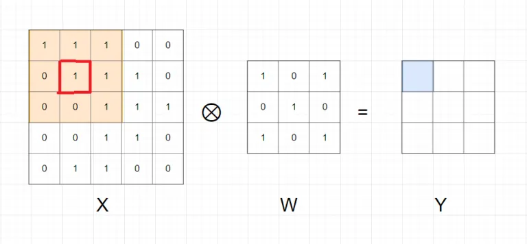

# ✏️ MNIST Digit Recognizer

An interactive Streamlit demo for a **Convolutional Neural Network** trained on
the classic [MNIST dataset](http://yann.lecun.com/exdb/mnist/).

Draw a digit with your mouse (or upload an image) and watch the model predict
it in real time — complete with per-class confidence scores and inference timing.



---

## 🗂️ Project Structure

```
MNIST---Digit-Recognizer/
├── app.py                    ← Streamlit demo application
├── train.py                  ← Model training script
├── requirements.txt          ← Python dependencies
├── README.md                 ← This file
│
├── model/
│   ├── __init__.py
│   ├── architecture.py       ← CNN definition (build_model)
│   └── mnist_cnn.h5          ← Saved weights (created by train.py)
│
└── utils/
    ├── __init__.py
    ├── image_processing.py   ← Preprocessing for canvas & uploads
    └── inference.py          ← Model loading & predict()
```

---

## 🚀 Quick Start

### 1 — Clone & install dependencies

```bash
git clone <repo-url>
cd MNIST---Digit-Recognizer

# Create a virtual environment (recommended)
python -m venv .venv
source .venv/bin/activate        # Windows: .venv\Scripts\activate

pip install -r requirements.txt
```

### 2 — Train the model

```bash
python train.py
```

This will:
1. Download MNIST automatically (~11 MB, cached by Keras)
2. Train the CNN for **5 epochs** on 60 000 training images
3. Evaluate on 10 000 test images (~99 % accuracy)
4. Save the weights to `model/mnist_cnn.h5`

> Training takes approximately **2–5 minutes** on a modern CPU (faster with a GPU).

Optional flags:
```bash
python train.py --epochs 10          # train longer for marginal accuracy gain
python train.py --out path/model.h5  # custom output path
```

### 3 — Run the demo

```bash
streamlit run app.py
```

Open the URL shown in your terminal (usually `http://localhost:8501`).

---

## 🧠 Model Architecture

| Layer | Type | Config |
|-------|------|--------|
| 1 | Conv2D | 64 filters · 3×3 · ReLU · same-padding |
| 2 | MaxPooling2D | 2×2 · stride 2 |
| 3 | Conv2D | 32 filters · 3×3 · ReLU · same-padding |
| 4 | MaxPooling2D | 2×2 · stride 2 |
| 5 | Flatten | — |
| 6 | Dense | 10 units · Softmax |

**Total parameters:** ~60 000  
**Optimizer:** Adam (default learning rate)  
**Loss:** Categorical cross-entropy  

### Input / Output Format

| | Shape | Values |
|--|-------|--------|
| **Input** | `(1, 28, 28, 1)` | Float32 in `[0, 1]` · white digit on black background |
| **Output** | `(1, 10)` | Softmax probabilities summing to 1 |

### Preprocessing Pipeline

```
Raw image
  ↓  Convert to grayscale (L channel)
  ↓  Resize to 28 × 28 (Lanczos filter)
  ↓  Auto-invert if background is light (uploads)
  ↓  Normalise pixels to [0, 1]
  ↓  Reshape to (1, 28, 28, 1)
  ↓  model.predict()
```

---

## 📊 Expected Performance

| Metric | Value |
|--------|-------|
| Test accuracy | **~99 %** |
| Test loss | ~0.03 |
| Inference time (CPU) | < 20 ms per image |
| Training time (5 epochs, CPU) | 2–5 min |

---

## ⚠️ Limitations

- **Dataset bias:** Trained exclusively on centred, clean MNIST digits. Real-world
  handwriting (different styles, sizes, or orientations) may reduce accuracy.
- **Single digit only:** The model classifies one digit per image. Multi-digit
  input is not supported.
- **Grayscale only:** Colour images are automatically converted to grayscale.
- **Fixed input size:** All images are resized to 28 × 28, which may distort
  unusual aspect ratios.
- **No rotation invariance:** Very tilted digits may be misclassified.

---

## 🛠️ Development Notes

### Why Streamlit?

Streamlit is ideal for ML demos because:
- Zero frontend code required
- Built-in widget library (file uploader, progress bars)
- `@st.cache_resource` keeps the model in memory across requests
- `streamlit-drawable-canvas` provides a smooth freehand drawing widget

### Running on GPU

TensorFlow will use a GPU automatically if CUDA is installed.  No code changes
are needed.

---

## 📝 License

MIT — feel free to use, modify, and distribute.
